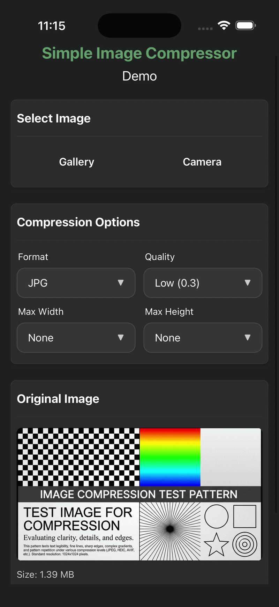

# react-native-simple-image-compressor

[](https://www.npmjs.com/package/react-native-simple-image-compressor)
[](https://github.com/Pugavkomm/react-native-simple-image-compressor/actions/workflows/ci.yml)
[](https://opensource.org/licenses/MIT)
[]()


[](https://www.npmjs.com/package/react-native-simple-image-compressor)
[](https://badge.socket.dev/npm/package/react-native-simple-image-compressor/0.2.0)
[](https://github.com/Pugavkomm/react-native-simple-image-compressor/blob/dev/CONTRIBUTING.md)

Simple image compressor

## Installation

```sh
npm install react-native-simple-image-compressor react-native-nitro-modules
```

> **Important Note**: [Read more about WebP support on iOS](#enable-support-webp-on-ios)



*Fig. 1. Example application demo*

<!-- TOC -->
* [react-native-simple-image-compressor](#react-native-simple-image-compressor)
  * [Installation](#installation)
  * [Abstract](#abstract)
  * [Features](#features)
  * [Enable support WebP on IOS](#enable-support-webp-on-ios)
  * [Usage](#usage)
    * [Imperative API](#imperative-api)
    * [As a hook](#as-a-hook)
  * [Input formats](#input-formats)
  * [OutputCompressedFormat](#outputcompressedformat)
  * [CompressOptions](#compressoptions)
  * [CompressedResult](#compressedresult)
  * [EXIF metadata](#exif-metadata)
  * [Additional functions](#additional-functions)
    * [getFileSize](#getfilesize)
  * [Dependencies](#dependencies)
    * [Android](#android)
    * [iOS](#ios)
  * [Codec `libwebp`](#codec-libwebp)
  * [Best Practice](#best-practice)
    * [Storage management.](#storage-management)
  * [Additional information](#additional-information)
  * [Contributing](#contributing)
  * [Changelog](#changelog)
  * [License](#license)
  * [TODO](#todo)
<!-- TOC -->

## Abstract

This library allows you to compress local images from the file system using their URI (remote HTTP URLs are not
supported). It was primarily designed to compress freshly taken camera photos, significantly reducing file size before
uploading them to a server.

## Features

- **OOM (Out-of-Memory) Safe**: Images are downsampled directly during decoding (`inSampleSize` on Android, `ImageIO` on
  iOS). The library never loads full-resolution images into memory, completely preventing OOM crashes even on giant 4K+
  camera photos.
- **Blazing Fast (Powered by Nitro Modules)**: Built with the RN Nitro architecture. Zero bridge overhead and direct
  `C++`
  to Swift/Kotlin communication make the compression fast.
- **Smart orientation and EXIF Preservation**: Automatically reads `EXIF` orientation and "bakes" the correct rotation
  directly into the pixels. It also safely transfers valuable `EXIF` metadata (like `GPS` and Camera info) to the
  compressed image (only for `JPEG` output).
- **Tiny footprint**: Minimal dependencies. The library relies heavily on native APIs (`BitmapFactory` for Android and
  `ImageIO` for iOS) to keep the app's bundle size as small as possible.
- **Next-Gen formats support**: Supports modern formats including WebP and WebP-Lossless across both (Android and iOS)
  platforms (utilizing native APIs where possible and `libwebp` as a fallback on iOS).
- **Aspect ratio preservation**: Intelligently scales images to fit within your desired `maxWidth` and `maxHeight`
  bounds without ever stretching or distorting the original aspect ratio.
- **Production Ready & Tested**: Backed by comprehensive native unit tests (Swift/Kotlin) to ensure maximum stability
  and prevent regressions across edge cases.

> `react-native-nitro-modules` is required as this library relies on [Nitro Modules](https://nitro.margelo.com/).

## Enable support WebP on IOS

iOS has natively supported `WebP` decoding since iOS 14, but native encoding is still unavailable. However, this library
allows you to enable WebP as an output format (see more: [Codec libwebp](#codec-libwebp)).

To enable this feature, add the following lines to your `ios/Podfile`:

```ruby
pod 'SimpleImageCompressor', :path => '../node_modules/react-native-simple-image-compressor', :subspecs => ['WebP']
pod 'libwebp', :modular_headers => true
```

> **Note**: If you omit these lines, the output format will automatically fall back to `.jpg` when `.webp` or
`.webp-lossless` is requested.

> **⚠️Important**: WebP and WebP-Lossless compression can be slow in debug mode. Test in release mode for actual
> performance.

## Usage

### Imperative API

```tsx
import {
  compressImage,
  getFileSize,
  type CompressOptions,
} from 'react-native-simple-image-compressor';

//...

const options: CompressOptions = {
  quality: 1.0,
  maxWidth: 1024,
  maxHeight: 1024,
  format: 'webp',
};

const originalSize = await getFileSize(originalImageUri);
console.log(`Original size: ${originalSize} bytes`);

const result = await compressImage(originalImageUri, options);
console.log(`Compressed size: ${result.fileSize} bytes`);

//...

<Image
  source={{ uri: result.uri }}
  style={styles.imagePreview}
/>
```

### As a hook

You can use the hook `useImageCompressor`:

```tsx
import { Alert } from 'react-native';
import { type CompressOptions, useImageCompressor, } from 'react-native-simple-image-compressor';

export const CompressorWidget = () => {
  // ...
  const { compress, getFileSize, isCompressing } = useImageCompressor();

  const [options, setOptions] = useState<CompressOptions>({
    format: 'webp',
    quality: 0.8,
    maxWidth: 1000,
    maxHeight: 1000,
  });

  const checkOriginalSize = async () => {
    if (!originalImage) return;
    const size = await getFileSize(originalImage);
    if (size) console.log(`Original size: ${size} bytes`);
  };

  const handleCompress = async () => {
    if (!originalImage) return;

    const finalOptions: CompressOptions = {
      ...options,
      maxWidth: options.maxWidth === 0 ? undefined : options.maxWidth,
      maxHeight: options.maxHeight === 0 ? undefined : options.maxHeight,
    };

    const result = await compress(originalImage, finalOptions);
    if (result) {
      setCompressedImage(result.uri);
      // use the library's returned fileSize if available, otherwise fallback
      if (result.fileSize) {
        setCompressedSize(result.fileSize);
      } else {
        const size = await getFileSize(result.uri);
        if (size) setCompressedSize(size);
      }
    } else {
      Alert.alert('Error', 'Compression failed');
    }
  };

  // ...
};
```

## Input formats

This library supports the following input formats natively:

- JPEG / JPG
- PNG
- WebP
- HEIC / HEIF
- BMP

## OutputCompressedFormat

This library supports the following output formats, set via the `OutputCompressedFormat` parameter
in [CompressOptions](#compressoptions)

| Format name   | Parameter value | Output file extension | Notes                                                                                           |
|---------------|-----------------|-----------------------|-------------------------------------------------------------------------------------------------|
| PNG           | `png`           | `.png`                | This format does not support lossy compression. EXIF metadata will be lost.                     |
| WebP          | `webp`          | `.webp`               | EXIF metadata will be lost. See [how to enable WebP on iOS](#enable-support-webp-on-ios).       |
| WebP lossless | `webp-lossless` | `.webp`               | EXIF metadata will be lost. See [how to enable WebP on iOS](#enable-support-webp-on-ios).       |
| JPEG          | `jpg` or `jpeg` | `.jpg`                | EXIF metadata (GPS, Camera, etc.) is preserved. See details in [EXIF metadata](#exif-metadata). |

> **Note on WebP Lossless for Android:**
> True `webp-lossless` encoding is supported natively starting from Android 11 (API 30+). On devices running Android
> 10 (API 29) or lower, the library automatically falls back to standard `webp` encoding but forces the `quality`
> parameter to `1.0` to emulate lossless compression as closely as possible.

## CompressOptions

Currently, only one compression method is available: `compressImage`. It accepts a `uri` and `options` of type
`CompressOptions` (see all available options below).

| Option name            | Type                                                | Required | Description                                                                                                                                                                                                                          |
|------------------------|-----------------------------------------------------|----------|--------------------------------------------------------------------------------------------------------------------------------------------------------------------------------------------------------------------------------------|
| quality                | `number`                                            | YES      | Compression quality. Valid values range from `0.0` (lowest quality and minimal size) to `1.0` (highest quality and maximum size). For more details on supported formats, see [OutputCompressedFormat](#outputcompressedformat)       |
| maxWidth               | `number`                                            | NO       | The maximum width of the converted image. Note: This boundary limit applies to the logical (viewable) width of the image, automatically taking EXIF orientation into account (see [Resize explanation](docs/resizeExplanation.md)).  |
| maxHeight              | `number`                                            | NO       | The maximum height of the converted image. Note: This boundary limit applies to the logical (viewable) width of the image, automatically taking EXIF orientation into account (see [Resize explanation](docs/resizeExplanation.md)). |
| enablePhysicalRotation | `boolean`                                           | NO       | if true, physically rotates the image pixels based on EXIF orientation. Read [this detailed guide with visual examples to understand hot physical vs logical dimensions work under the hood](docs/resizeExplanation)                 |
| format                 | [`OutputCompressedFormat`](#outputcompressedformat) | YES      | The target image format                                                                                                                                                                                                              |

## CompressedResult

The method `compressImage` returns a `CompressResult` object. See all available properties below:

| Property name    | Type                                                | Required | Description                                                                |
|------------------|-----------------------------------------------------|----------|----------------------------------------------------------------------------|
| uri              | `string`                                            | YES      | The local file URI of the compressed image (e.g., `file:///path/to/image`) |
| width            | `number`                                            | YES      | The width of the compressed image in pixels                                |
| height           | `number`                                            | YES      | The height of the compressed image in pixels                               |
| format           | [`OutputCompressedFormat`](#outputcompressedformat) | YES      | The final compressed image format                                          |
| fileSize         | `number`                                            | YES      | The compressed image's file size in bytes                                  |
| originalFileSize | `number`                                            | YES      | The original image's file size in bytes                                    |

> **Important note**: Due to iOS compatibility fallbacks, the returned `format` property may be `jpg` even when `webp`
> or `webp-lossless` is requiest. See details in [Enable support webp on iOS](#enable-support-webp-on-ios)

## EXIF metadata

> **Important**: The following information applies only to `jpeg` and `jpg` output formats (
> see [OutputCompressedFormat](#outputcompressedformat)). Other output formats (`png`, `webp`, `webp-lossless`) do not
> support
> this feature

## Additional functions

In this section, some additional functions of the library are described.

### getFileSize

Use `getFileSize` to retrieve the size of a file. This is useful for making decisions before compression (e.g., checking
if a file needs to be compressed) or verifying the file size after compression.

Example:

```tsx
import { getFileSize } from 'react-native-simple-image-compressor';

const checkFileSize = async (uri: string) => {
  try {
    const sizeInBytes = await getFileSize(uri);
    console.log(`File size is ${sizeInBytes} bytes`);

    if (sizeInBytes > 5 * 1024 * 1024) {
      console.log('File is larger than 5MB, consider compressing it.');
    }
  } catch (error) {
    console.error('Failed to get file size:', error);
  }
};
```

## Dependencies

### Android

Exifinterface [androidx.exifinterface:exifinterface:1.4.2](https://developer.android.com/jetpack/androidx/releases/exifinterface#1.4.2)

### iOS

WebP codec [libwebp 1.5.0](https://cocoapods.org/pods/libwebp) ([Support webp on iOS](#enable-support-webp-on-ios)).

## Codec `libwebp`

This library aims to provide consistent functionality across Android and iOS. While Android natively supports WebP
encoding via the `Bitmap` class, native WebP encoding on iOS is still unavailable. To bridge this gap and provide full
WebP
support on iOS, this library integrates the `libwebp` codec.

## Best Practice

### Storage management.

The compressed images are saved in the device's temporary cache directory. While the OS may
eventually clear these files when storage is low, it's highly recommended that you manually delete the file (e.g., using
`react-native-fs` or `expo-file-system`) once you are done with it (e.g., after successfully uploading it to some
server) to prevent your app's cache size from growing unnecessarily.

> In fact, there are plans to work on this issue in the future.

## Additional information

- [Resize explanation](docs/resizeExplanation.md)

## Contributing

- [Development workflow](CONTRIBUTING.md#development-workflow)
- [Sending a pull request](CONTRIBUTING.md#sending-a-pull-request)
- [Code of conduct](CODE_OF_CONDUCT.md)

## Changelog

[CHANGELOG.md](CHANGELOG.md)

## License

MIT

## TODO

- [ ] Add test for each input format (png, jpg, webp)
- [ ] Add additional metadata to output object

---

Made with [create-react-native-library](https://github.com/callstack/react-native-builder-bob)
