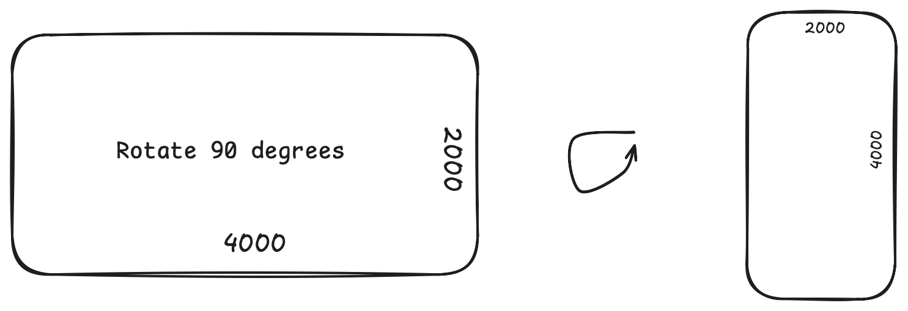
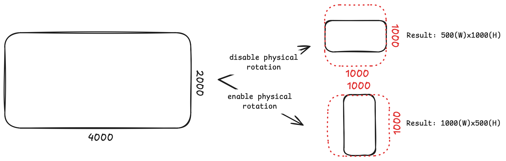
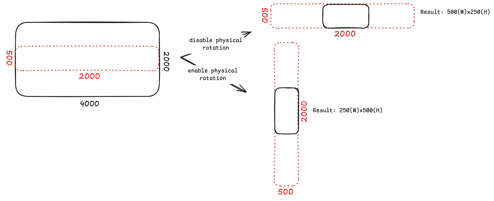

# Resize explanation

<!-- TOC -->
* [Resize explanation](#resize-explanation)
  * [Abstract](#abstract)
  * [Understanding Physical vs. Logical Dimensions](#understanding-physical-vs-logical-dimensions)
  * [EXIF metadata & `enablePhysicalRotation`](#exif-metadata--enablephysicalrotation)
  * [Examples](#examples)
    * [Input data](#input-data)
    * [Example 1. Square Box](#example-1-square-box)
    * [Example 2. Horizontal Box (Limiting "across" the photo)](#example-2-horizontal-box-limiting-across-the-photo)
    * [Example 3. Limits larger than the image (Upscaling)](#example-3-limits-larger-than-the-image-upscaling)
<!-- TOC -->

## Abstract

This section describes how image scaling (resize) behaves with different `maxWidth` and `maxHeight` parameter values,
and explains the outcome when physical rotation is enabled (`enablePhysicalRotation=true`).

## Understanding Physical vs. Logical Dimensions

Before diving into how `maxWidth`, `maxHeight` and `enablePhysicalRotation` work, it's important to understand the
difference between physical and logical image dimensions due to EXZF orientation.

**Physical Dimensions**: How the pixels are actually stored on the disk. For example, phone camera sensors are usually
landscape, so a portrait photo might physically be stored sideways as `4000(W)x2000(H)`.

**Logical (Viewable) Dimensions**: How the image appears on the screen. The camera adds an EXIF metadata tag (e.g., "
Rotate 90"). Image viewers read this tag and rotate the image on the fly, showing it ti the user as `2000(W)x4000(H)`.

> **Important Note: How bounds and rotation work together**
> The library strictly separates the scaling logic from the physical file creation:
>
> 1. **Logical Constraints:** The `maxWidth` and `maxHeight` limits are **always** applied to the **logical** (viewable)
     dimensions of the image. This ensures your limits work predictably (exactly as the user sees the photo), regardless
     of how the camera sensor captured it.
> 2. **Physical Saving:** The `enablePhysicalRotation` flag only decides **how** this scaled image is written back to
     the disk.
> - If `true`, the library physically rotates the pixels to match the logical view and clears the EXIF orientation.
> - If `false`, the library scales the pixels but keeps them in their original sensor layout, preserving the EXIF  "
    Rotate" tag so viewers can rotate it at render time.

## EXIF metadata & `enablePhysicalRotation`

Suppose a user takes a photo in portrait orientation. The physical size of the photo captured by the camera sensor might
be `4000(W)x2000(H)`. Since the metadata indicates that the photo needs to be rotated by 90 degrees, the user wil
ultimately see the image on their screen as `2000(W)x4000(H)`.

*Fig. 1: Physical and Logical photo*

If we enable physical rotation (`enablePhysicalRotation=true`), then when scaling down the image by half, for example,
we will get an image of `1000(W)x2000(H)`. This happens because during compression, we create a new image that
physically applies the rotation. This means the resulting image file will literally have 1000 pixels in width and 2000
pixels in height. Consequently, the rotation information is removed from the EXIF metadata to prevent double-rotation.
This approach is higly convenient when preparing image data to be sent to a server.

If physical rotation is disabled (`enablePhysicalRotation=false`), the upong scaling down by half, the resulting
physical image file will have the dimensions `2000(W)x1000(H)`. The EXIF rotation metadata is preserved, so viewers will
rotate it back to `1000(W)x2000(H)` at render time.

## Examples

### Input data

- Sensor captured photo (Physical): `4000(W)x2000(H)`. The image lies on its side.
- EXIF tag: `Rotate 90 degrees`.
- Viewable image (Logical): `2000(W)x4000(H)`.A portrait photo with 1:2 aspect ratio.

### Example 1. Square Box

`maxWidth: 1000, maxHeight: 1000`.

If we try to fit a `2000(W)x4000(H)` image into a `1000(W)x1000(H)` square, the obvious bottleneck here is the height.
For 4000 to fit into 1000, the photo must be scaled down by 4 times, hence the reduction coefficient is `0.25`. From now
on, we will refer to this reduction coefficient as `scale`. It's important to not that this coefficient strictly changes
the pixel dimensions of the photo and isn't directly related to file size compression.

- With `enablePhysicalRotation=true`: A new file of `500(W)x1000(H)` is created, and EXIF orientation is cleared.
- With `enablePhysicalRotation=false`: A new file of `1000(W)x500(H)` is created, and EXIF remains "Rotate 90".

*Fig. 2: Square Box example*

### Example 2. Horizontal Box (Limiting "across" the photo)

`maxWidth: 2000, maxHeight: 500`

If we try to fit vertical `2000(W)x4000(H)` image into a wide `2000x500` horizontal box, the bottleneck is once again
the height. To fit 4000 into 500, we mast scale the image down by 8 times (`scale=0.125`).

- With `enablePhysicalRotation=true`: A new file of `250(W) x 500(H)` is created, and EXIF orientation is cleared.
- With `enablePhysicalRotation=false`: A new file of `500(W) x 250(H)` is created, and EXIF remains "Rotate 90".

> **Note**: In both cases, the user will ultimately see a 250(W) x 500(H) image on their screen. Notice that the
> resulting
> width of 250 is nowhere near the maxWidth limit of 2000 because the height limit constrained the scaling first.

*Fig. 3: Horizontal Box example*

### Example 3. Limits larger than the image (Upscaling)

`maxWidth: 5000, maxHeight: 8000`

It the boundary limits exceed the original image size (e.g., source is `2000x4000`), the calculated `scale` becomes
greater than `1.0`. To prevent quality loss from artificial upscaling, the library does not enlarge the image. The
`scale` is capped at `1.0`, preserving the original dimensions.
